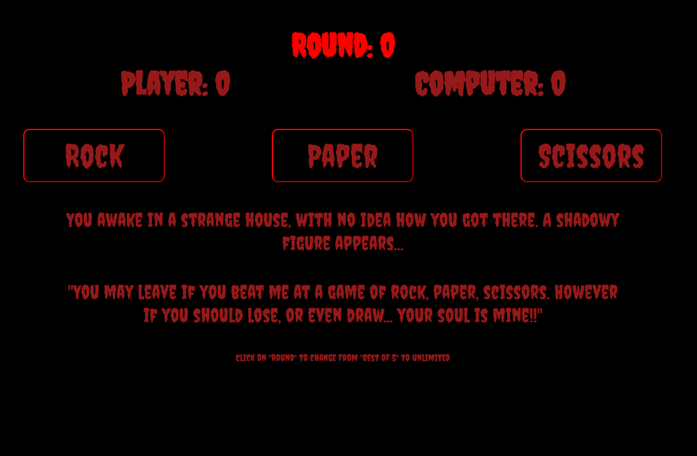

# Rock, Paper or Scissors



## Summary

**Hosted:** [Rock Paper Scissors](https://blurryq.github.io/rock-paper-scissors/)

A fun and interactive rock-paper-scissors game where you can play against the computer. Choose between a best of 5 rounds or unlimited rounds for a more flexible experience.

## Features

This project showcases my skills with HTML, CSS, and JavaScript, and includes:

- **Round Management**: You can toggle between a "best of 5" format and unlimited rounds, giving the game more replayability and variety.
- **Player vs Computer**: You’ll face off against the computer, where your choice of rock, paper, or scissors will trigger a round and provide immediate results.
- **Scoreboard**: The game tracks the player’s and computer’s scores throughout, updating in real-time as rounds progress.
- **Dynamic Game Results**: The result of each round (win, lose, or draw) is shown instantly, making it clear how the round went.
- **Game Over Logic**: Once a player wins 3 rounds in the best of 5 format the game will end and prompt the player to start a new game or continue playing.
- **Visual Feedback**: The UI dynamically updates with messages and score changes, providing clear feedback after each round, making the experience more engaging.

## Setup

To get started with this project, follow the steps below:

### 1. Fork the Repository

First, you need to fork this repository to your GitHub account by clicking the "Fork" button near the top right of this page. If you are unfamiliar with this process, please follow this GitHub [guide](https://docs.github.com/en/pull-requests/collaborating-with-pull-requests/working-with-forks/fork-a-repo).

### 2. Clone the Repository

Next, clone the repository to your local machine using the following command. Make sure to replace `your-username` with your GitHub username:

```
git clone https://github.com/your-username/rock-paper-scissors
```

### 3. Running the File

Once cloned, navigate to your project folder, locate the HTML file, and double-click it. This should open the file in your default browser.

Alternatively, if you're using Visual Studio Code, you can install the "Live Server" extension and use it to launch the project by right-clicking on the HTML file and selecting **Open with Live Server**.

### 4. Have Fun

Draw away to your heart's content, or play with the code to make it better—or break it better!

## Challenges

This project taught me a lot about handling game logic and working with dynamic content. Some of the key challenges I faced included:

- **Game Flow and State Management**: Managing the different game states (round types, game progress) and ensuring everything updates properly when switching between modes was tricky but rewarding.
- **Handling Randomness**: Getting the computer to pick randomly between rock, paper, and scissors, while keeping it fair and unpredictable, was one of the more interesting challenges.
- **UI Updates**: Keeping the UI responsive by updating the scoreboard and round info after each round involved some careful DOM manipulation to make sure everything displayed correctly and on time.
- **Conditional Game Over Logic**: I had to figure out how to end the game either after a player wins 3 rounds or when the round limit is reached, which added some complexity to the game flow.
- **Displaying Results**: Making sure that the results of each round (like win, lose, or draw) were clear and easy to understand was important for keeping the game fun and intuitive.
- **Ensuring Responsive Design**: I had to make sure the game was responsive on different screen sizes, ensuring that all buttons were clickable and well-spaced across devices.